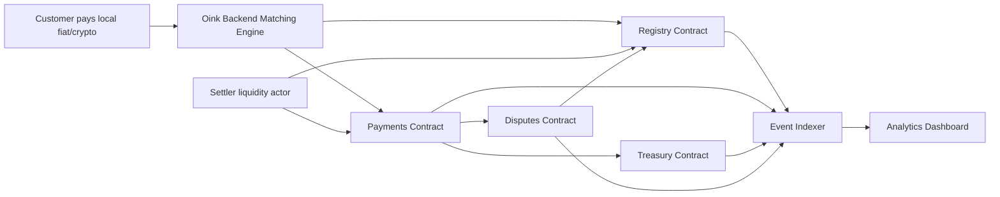
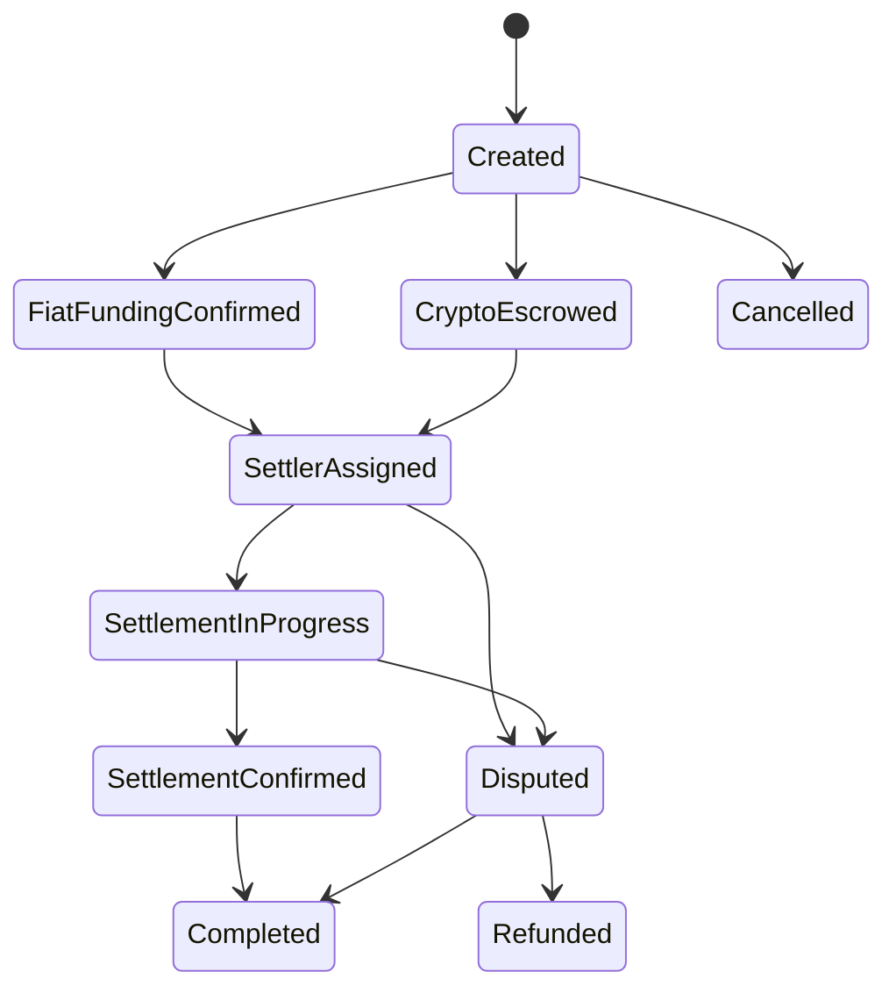

# Oink Protocol Architecture

```mermaid
flowchart LR
  Customer[Customer pays local fiat/crypto] --> Backend[Oink Backend Matching Engine]
  Backend --> Registry[Registry Contract]
  Backend --> Payments[Payments Contract]
  Settler[Settler liquidity actor] --> Registry
  Settler --> Payments
  Payments --> Treasury[Treasury Contract]
  Payments --> Disputes[Disputes Contract]
  Disputes --> Registry
  Indexer[Event Indexer] --> Dashboard[Analytics Dashboard]
  Registry --> Indexer
  Payments --> Indexer
  Treasury --> Indexer
  Disputes --> Indexer
```

```mermaid
stateDiagram-v2
  [*] --> Created
  Created --> FiatFundingConfirmed
  Created --> CryptoEscrowed
  FiatFundingConfirmed --> SettlerAssigned
  CryptoEscrowed --> SettlerAssigned
  SettlerAssigned --> SettlementInProgress
  SettlementInProgress --> SettlementConfirmed
  SettlementConfirmed --> Completed
  Created --> Cancelled
  SettlerAssigned --> Disputed
  SettlementInProgress --> Disputed
  Disputed --> Refunded
  Disputed --> Completed
```
