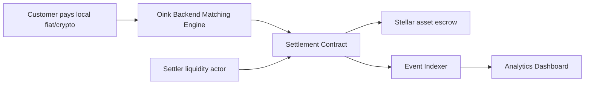
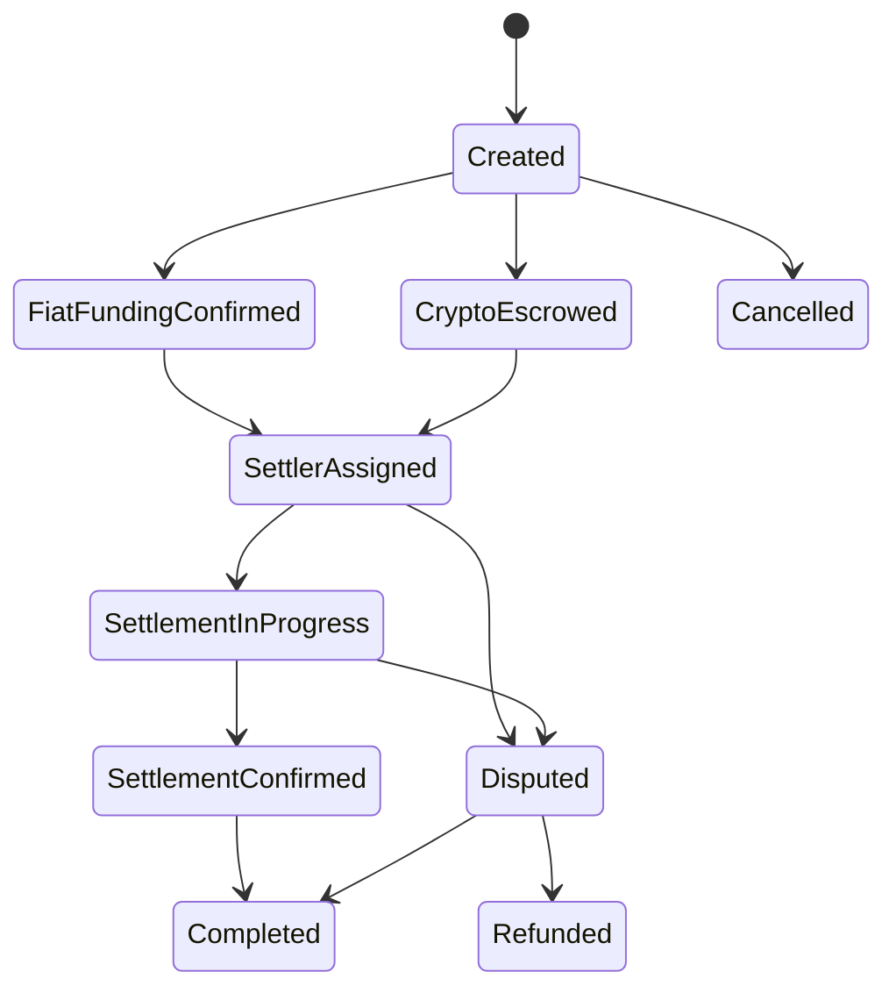

# Oink Protocol Architecture

Only the settlement contract and shared SDK are active Cargo workspace members.
Registry, treasury, and standalone dispute contracts remain design drafts; the
active settlement contract contains its own dispute and escrow lifecycle.

